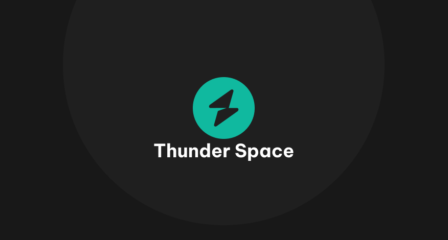

<!-- PROJECT LOGO -->
<br />
<p align="center">
  <a href="">
    
  </a>

  <h3 align="center" style="font-weight: bold">Thunder Space</h3>

  <p align="center">
    Human resource management!
    <br />
    <a href="https://hrmdoc.vercel.app/"><strong>Explore the docs »</strong></a>
    <br />
    <br />
    <a href="https://github.com/ryderdinh/thunder-space">View</a>
    ·
    <a href="https://github.com/ryderdinh/thunder-space/issues">Report Bug</a>
    ·
    <a href="https://github.com/ryderdinh/thunder-space/issues">Request Feature</a>
  </p>
</p>

<!-- TABLE OF CONTENTS -->
<details open="open">
  <summary>Table of Contents</summary>
  <ol>
    <li>
      <a href="#about-the-project">About The Project</a>
    </li>
    <li>
      <a href="#for-developer">For developer</a>
    </li>
    <li>
      <a href="#getting-started">Getting Started</a>
      <ul>
        <li><a href="#installation">Installation</a></li>
      </ul>
    </li>
    <li><a href="#">Usage</a></li>
    <li><a href="#license">License</a></li>
    <li><a href="#contact">Contact</a></li>
    <li><a href="#more">More</a></li>
  </ol>
</details>

<!-- ABOUT THE PROJECT -->

## About The Project

<p align="center">
  <a href="">
  
  </a>
</p>

Hi guys, this is your company's ideal human resource management app. Successfully manage your employees & centralize all your HR information Try Thunder Space. Employee evaluation made easy. Set up your evaluation process, get feedback and more. No credit card required.

Here's why:

- You can remote attendance (solution when working online)
- Track/manage company events
- Keep track of timesheets
- Submit report/application form
- Task/project management

Thunder Space is a pretty simple solution for any company. Try it now because it's completely free!

## For Developer

### Built With

This project is built using add-ons/plugins:

- [ReactJS v17](https://reactjs.org/)
- [NodeJS v14.x](https://nodejs.org/en/)
- [MongoDB v4.x](https://mongodb.github.io/node-mongodb-native/4.1/)

<!-- GETTING STARTED -->

## Getting Started

This is an example of how you may give instructions on setting up your project locally.
To get a local copy up and running follow these simple example steps.

### Installation

- With `npm`

```zh
npm i
```

- With `yarn`

```zh
yarn
```

<!-- USAGE EXAMPLES -->

## Usage

_For more examples, please refer to the [Documentation](https://thunderspace.netlify.app/documentation)_

<!-- LICENSE -->

## License

Distributed under the MIT License. See `LICENSE` for more information.

<!-- CONTACT -->

## Contact

Dinh Quang Anh - [@pastetu_47](https://twitter.com/pastetu_47) - dinhquanganhdev@gmail.com

Pham Huu Thang - [@pht](https://twitter.com/pht) - phamhuuthang@gmail.com

## More

Project Link: [https://github.com/ryderdinh/thunder-space](https://github.com/ryderdinh/thunder-space)

Api Documentation: [https://documenter.getpostman.com/view/14016827/UzBiQoxb](https://documenter.getpostman.com/view/14016827/UzBiQoxb)

[contributors-shield]: https://img.shields.io/github/contributors/ryderdinh/thunder-space.svg?style=for-the-badge
[contributors-url]: https://github.com/ryderdinh/thunder-space/graphs/contributors
[forks-shield]: https://img.shields.io/github/forks/ryderdinh/thunder-space.svg?style=for-the-badge
[forks-url]: https://github.com/ryderdinh/thunder-space/network/members
[stars-shield]: https://img.shields.io/github/stars/ryderdinh/thunder-space.svg?style=for-the-badge
[stars-url]: https://github.com/ryderdinh/thunder-space/stargazers
[issues-shield]: https://img.shields.io/github/issues/ryderdinh/thunder-space.svg?style=for-the-badge
[issues-url]: https://github.com/ryderdinh/thunder-space/issues
[license-shield]: https://img.shields.io/github/license/ryderdinh/thunder-space.svg?style=for-the-badge
[license-url]: https://github.com/ryderdinh/thunder-space/blob/master/LICENSE.txt
[product-screenshot]: images/screenshot.png
